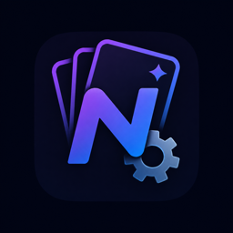

  
  <h1>Nodalia Cards Engine</h1>
  
<strong>Optional native backend for the advanced features of Nodalia Cards.</strong>

Nodalia Cards Engine runs background notifications, shared dismissals and Climate schedules inside Home Assistant. It is an optional companion to the [Nodalia Cards](https://github.com/danielmigueltejedor/nodalia-cards) Dashboard plugin, not a replacement for it.

## Why it is separate

The cards remain installed through HACS as a **Dashboard** repository, so existing users do not need to migrate their resources or dashboard YAML. Install this repository as an **Integration** only when you want the advanced server-side features.

| Repository | HACS category | Purpose |
|---|---|---|
| [`nodalia-cards`](https://github.com/danielmigueltejedor/nodalia-cards) | Dashboard | Cards and visual editors |
| [`nodalia-cards-engine`](https://github.com/danielmigueltejedor/nodalia-cards-engine) | Integration | Optional persistent background engine |

## Features

- Background mobile notification profiles with presence, quiet-hours, severity and cooldown policies.
- Shared notification dismissals stored in Home Assistant.
- Persistent weekly Climate schedules executed at their native time boundaries.
- Authenticated WebSocket API; configuration writes require an administrator.
- Privacy-safe diagnostics and the `nodalia.test_notification` action.

## Compatibility

- Home Assistant `2025.1.0` or newer.
- Nodalia Cards `2.0.2` or newer for native Engine discovery (`2.0.3` recommended).
- The Engine is optional: cards that do not use a server-side feature continue working without it.

Stable **`1.0.0`** is the recommended Engine release. Keep existing packages, automations and helpers until the corresponding profile or schedule has been verified on your Home Assistant instance.

## Installation with HACS

1. Keep or install [Nodalia Cards](https://github.com/danielmigueltejedor/nodalia-cards) as a **Dashboard** custom repository.
2. In HACS, open **Custom repositories**.
3. Add `https://github.com/danielmigueltejedor/nodalia-cards-engine` with category **Integration**.
4. Download **Nodalia Cards Engine** and restart Home Assistant.
5. Open **Settings → Devices & services → Add integration**.
6. Search for **Nodalia Cards Engine** and confirm setup.
7. Reload the browser once so open Nodalia cards discover the Engine.

## Migration from packages and helpers

Do not remove an existing notification package or Climate automation immediately. Install the Engine, save the relevant card profile or schedule, test native delivery, and only then remove the old package, webhook automation and dedicated helpers. Ordinary cards continue to work when the Engine is absent.

## Using the Engine

- **Notifications Card:** enable its native/background Engine option and save the profile. Home Assistant then evaluates watched entities even when no dashboard is open.
- **Climate Card:** save a weekly schedule from the card. The Engine stores it in Home Assistant and applies each boundary without an `input_text`, package or generated automation.
- **Shared dismissals:** dismissing a notification in one dashboard is synchronized through Home Assistant for the same profile.

The cards communicate with the Engine through Home Assistant's authenticated WebSocket connection; no URL, token or YAML secret is required.

## Manual installation

Copy `custom_components/nodalia` into `/config/custom_components/nodalia`, restart Home Assistant, then add **Nodalia Cards Engine** from **Settings → Devices & services**.

## Security

- The frontend uses Home Assistant's authenticated WebSocket connection.
- Profile, schedule and test-notification writes require an administrator.
- Notification targets are restricted to `notify.*` entities or services.
- Stored profiles, watched entities and schedule slots have explicit limits.
- Diagnostics expose counts and versions, not notification content or entity identifiers.

Please report security issues privately through GitHub's **Report a vulnerability** option instead of opening a public issue.

## License

MIT. See [LICENSE](LICENSE).
